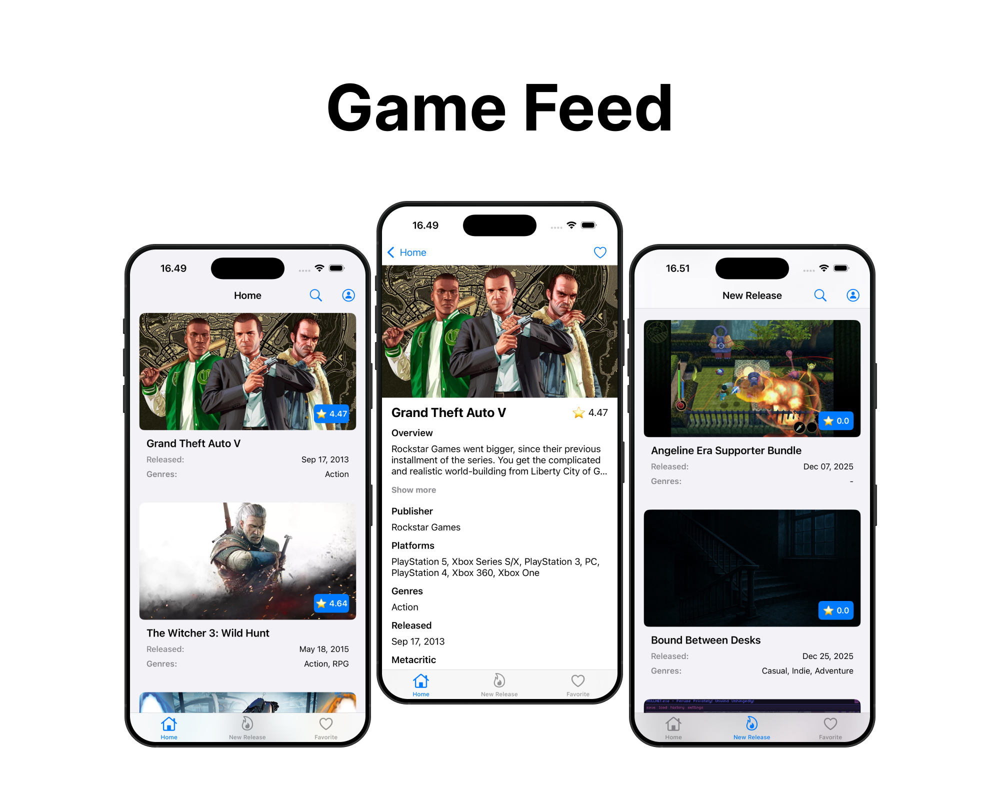

# GameFeed

GameFeed is an iOS app built using Swift that allows users to explore and discover video games. It provides a feed-like browsing experience where users can view game details such as title, release date, genre, and more. With a streamlined interface and clean architecture, GameFeed offers a smooth and responsive experience.

---



---

## 🎮 Features

✅ Browse a feed of games  
✅ View detailed information about each game  
✅ Display cover art, description, release date, platforms, and more  
✅ Structured using modern Swift design best practices  
✅ Includes basic test setup (`GameFeedTests`)  
✅ Code linting with SwiftLint (`.swiftlint.yml` included)

---

## 🧰 Tech Stack

| Component     | Technology |
|--------------|-----------|
| Language     | Swift |
| Platform     | iOS |
| UI Framework | UIKit (Programmatic) |
| Linting      | SwiftLint |
| Testing      | XCTest |

---

## 🚀 Getting Started

### ✅ Prerequisites

- Xcode (latest stable recommended)
- iOS Simulator or physical device
- Swift toolchain (bundled with Xcode)

### 📥 Installation

1. Clone the repository:
   ```bash
   git clone https://github.com/nazaralwi/GameFeed.git
   ```
2. Navigate to the directory:
   ```bash
   cd GameFeed
   ```
3. Open the project:
   ```bash
   open GameFeed.xcodeproj
   ```
4. Build and run:
   - Press `⌘R` in Xcode

---

## ✅ Running Tests

1. Select the `GameFeed` scheme in Xcode  
2. Run tests using `⌘U` or via `Product → Test`  
3. Test results will be displayed in the Xcode Test Navigator

---

## 📍 Roadmap / Future Enhancements

| Feature | Status |
|---------|--------|
| Offline caching | ⏳ Planned |
| Sorting & filtering | ⏳ Planned |
| Push notifications for game releases | ⏳ Planned |
| Accessibility improvements | ⏳ Planned |
| Performance optimization | ⏳ Planned |

---

## 🔐 Security

GameFeed is protected using AppSuit Premium Security, providing an additional layer of runtime and environment protection.

The integration helps safeguard the application against common security threats:
- Debugging detection
- Jailbreak detection
- App integrity validation
- Runtime threat analysis

Security checks are executed during the application launch phase to ensure the app is running in a trusted environment.

###🛡️ Security Behavior

If a security threat is detected:
- The app will display a security warning
- The detected issue will be categorized
- The application will terminate to prevent potential misuse

This approach helps protect:
- User data
- Application logic
- Runtime integrity

### 🧩 Implementation Details

AppSuit is integrated directly within the `AppDelegate`, where:
- `AS_Check()` performs a full security validation
- Returned error codes are analyzed
- Appropriate actions are taken based on detection results

The implementation is designed to maintain:
- Early threat detection
- Minimal performance impact
- Clear security feedback

---

## 🤝 Contributing

Contributions are welcome!

1. Fork this repository  
2. Create a feature branch (`git checkout -b feature/my-feature`)  
3. Commit your changes (`git commit -m "Add new feature"`)  
4. Push to your branch (`git push origin feature/my-feature`)
5. Open a Pull Request  

Please follow the code style and include tests where appropriate.
