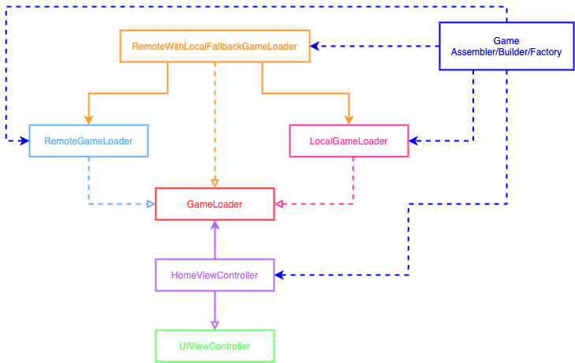

# Game Feed App - Home Feature

## BDD Specs

### Story: Customer requests to see their game list

### Narrative #1

> As an online customer
I want the app to automatically load the list of game
So I can always read the newest information of the game

#### Scenarios (Acceptance criteria)

```
Given the customer has connectivity
When the customer requests to see their game list
Then the app should display the list of game from remote
  And replace the cache with the new list of game
```

### Narrative #2

> As an offline customer
I want the app to show the latest saved version of my game list
So I can always read the information of the game

#### Scenarios (Acceptance criteria)

```
Given the customer doesn't have connectivity
And there’s a cached version of the list of game
When the customer requests to see the list of game
Then the app should display the latest games saved

Given the customer doesn't have connectivity
And the cache is empty
When the customer requests to see the list of game
Then the app should display an error message
```

## Use Cases

### Load Game Use Case

#### Data:
- URL

#### Primary course (happy path):
1. Execute "Load Game Items" command with above data.
2. System downloads data from the URL.
3. System validates downloaded data.
4. System creates game items from valid data.
5. System delivers game items.

#### Invalid data – error course (sad path):
1. System delivers error.

#### No connectivity – error course (sad path):
1. System delivers error.

### Load Game Fallback (Cache) Use Case

#### Data:
- Max age

#### Primary course:
1. Execute "Retrieve Game Items" command with above data.
2. System fetches game data from cache.
3. System validates cache age.
4. System creates game items from cached data.
5. System delivers game items.

#### Expired cache course (sad path): 
1. System delivers no game items.

#### Empty cache course (sad path): 
1. System delivers no game items.


### Save Game Items Use Case

#### Data:
- Game items

#### Primary course (happy path):
1. Execute "Save Game Items" command with above data.
2. System encodes game items.
3. System timestamps the new cache.
4. System replaces the cache with new data.
5. System delivers success message.

## Architecture



## Model Specs

### Game Item

| Property      | Type                |
|---------------|---------------------|
| `id`                                  | `Int`              |
| `name`                              | `String` |
| `released`                      | `String` (optional) |
| `rating`                          | `Double`               |
| `backgroundImage`        | `String` (optional) |
| `genres`                          | `[Genre]` (optional) |


### Payload contract

```
GET *url* (TBD)

200 RESPONSE

{
    "results": [
        {
            "id": "an id",
            "name": "a name",
            "released": "a release date",
            "rating": "a rating",
            "background_image": "https://a-backgrund-image.url",
            "genres": [
                {
                    "name": "a genre"
                },
                {
                    "name": "another genre"
                }
            ]
        },
        {
            "id": "another id",
            "name": "another name",
            "rating": "another rating",
            "background_image": "https://another-backgrund-image.url",
            "genres": [
                {
                    "name": "a genre"
                },
                {
                    "name": "another genre"
                }
            ]
        },
        {
            "id": "even another id",
            "name": "even another name",
            "released": "even another release date",
            "rating": "even another rating",
            "genres": [
                {
                    "name": "a genre"
                },
            ]
        },
        {
            "id": "yet another id",
            "name": "yet another name",
            "released": "yet another release date",
            "rating": "yet another rating",
            "background_image": "https://yet-another-backgrund-image.url",
        },
        ...
    ]
}
```
